# Codex CLI 离线安装指南

如果你所处的网络环境无法直接访问 npm，或者在线安装经常失败，可以直接使用这份离线安装方案，把 Codex CLI 在本地跑起来。

这份说明目前整理了三个平台版本：

- Windows x64
- macOS Apple Silicon，也就是 M1、M2、M3、M4
- macOS Intel

不包含 Linux。

## 安装前准备

目标电脑需要先安装 Node.js 和 npm。先在终端检查：

```powershell
node -v
npm -v
```

如果能正常显示版本号，说明前置环境已经具备。

## 先判断自己属于哪个平台

Windows 普通电脑一般使用 `windows-x64/npm-offline`。

Mac 需要先判断芯片架构。打开终端执行：

```bash
uname -m
```

结果对应关系：

- `arm64`：使用 `macos-arm64/npm-offline`
- `x86_64`：使用 `macos-x64/npm-offline`

## Windows x64 安装步骤

进入 Windows 离线安装目录：

```powershell
cd "你的路径\codex-npm-offline\windows-x64\npm-offline"
```

目录中会包含主包、Windows x64 平台包、安装脚本和配置脚本。

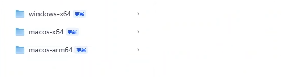

### 方式一：直接运行安装脚本

```powershell
.\install-codex-windows-x64.cmd
```

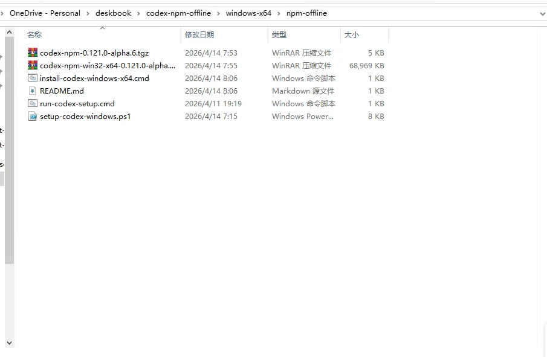

### 方式二：手动安装

```powershell
npm install -g .\codex-npm-0.121.0-alpha.6.tgz @openai/codex-win32-x64@file:.\codex-npm-win32-x64-0.121.0-alpha.6.tgz
```

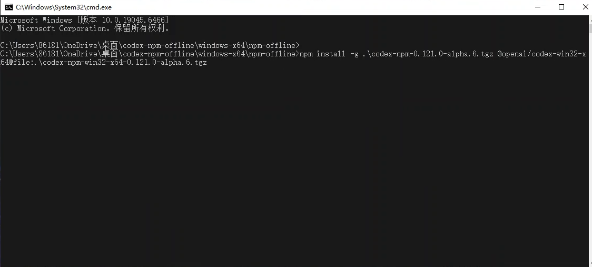

安装完成后检查：

```powershell
codex --version
```

能输出版本号，就说明安装成功。

## 运行配置脚本

安装完成后，双击运行配置脚本：

```powershell
.\run-codex-setup.cmd
```

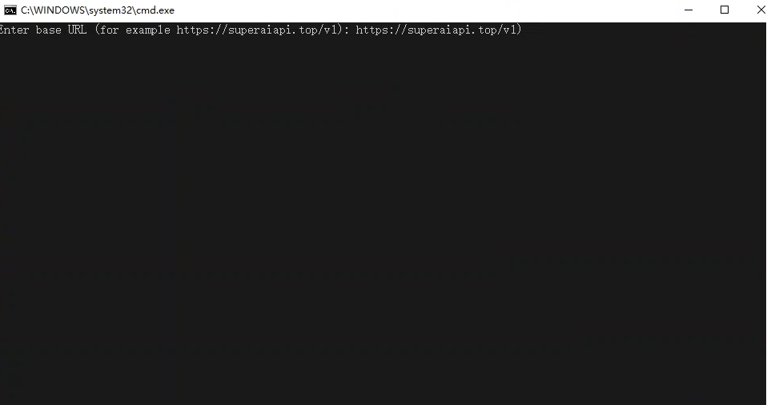

脚本会提示输入两项内容：

- base URL
- API key


把准备好的 API key 粘贴进去即可。

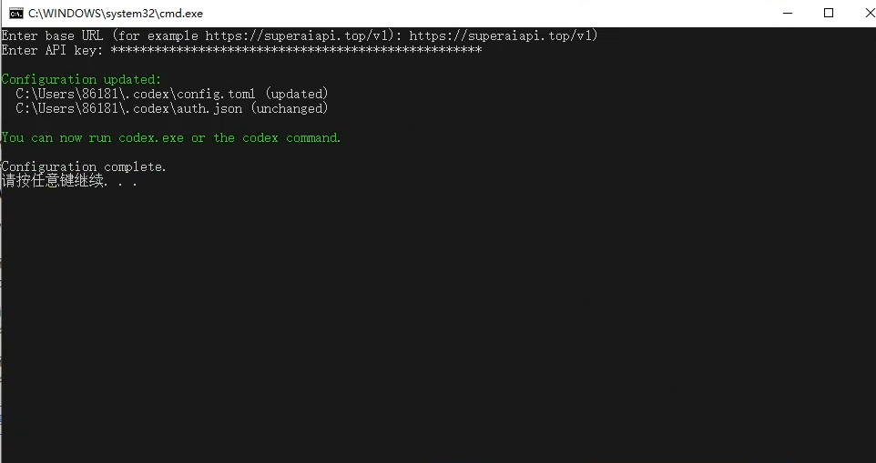

配置脚本会自动写入：

- `~/.codex/config.toml`
- `~/.codex/auth.json`

如果原来已有配置文件，脚本会先创建备份，再覆盖写入新配置。

配置完成后启动 Codex：

```powershell
codex
```

如果希望直接进入更自由的执行模式，也可以运行：

```powershell
codex --yolo
```

## macOS Apple Silicon 安装

适用于 M1、M2、M3、M4。

进入目录：

```bash
cd "/你的路径/codex-npm-offline/macos-arm64/npm-offline"
```

推荐直接运行安装脚本：

```bash
bash ./install-codex-macos-arm64.sh
```

手动安装命令如下：

```bash
npm install -g ./codex-npm-0.121.0-alpha.6.tgz @openai/codex-darwin-arm64@file:./codex-npm-darwin-arm64-0.121.0-alpha.6.tgz
```

安装完成后检查：

```bash
codex --version
```

然后运行配置脚本：

```bash
bash ./setup-codex-macos.sh
```

最后启动：

```bash
codex
```

## macOS Intel 安装

进入目录：

```bash
cd "/你的路径/codex-npm-offline/macos-x64/npm-offline"
```

推荐直接运行安装脚本：

```bash
bash ./install-codex-macos-x64.sh
```

手动安装命令如下：

```bash
npm install -g ./codex-npm-0.121.0-alpha.6.tgz @openai/codex-darwin-x64@file:./codex-npm-darwin-x64-0.121.0-alpha.6.tgz
```

安装完成后检查：

```bash
codex --version
```

然后运行配置脚本：

```bash
bash ./setup-codex-macos.sh
```

最后启动：

```bash
codex
```

## 常见问题

### 安装后找不到 codex 命令

先关闭当前终端，再重新打开一个终端后执行：

```bash
codex --version
```

### Windows 运行脚本被拦截

优先运行：

```powershell
.\run-codex-setup.cmd
```

这个脚本已经带了 `ExecutionPolicy Bypass`。

### Mac 提示脚本没有执行权限

直接用 bash 运行即可，不依赖执行权限位：

```bash
bash ./install-codex-macos-arm64.sh
bash ./setup-codex-macos.sh
```

Intel Mac 把安装脚本换成：

```bash
bash ./install-codex-macos-x64.sh
```

## 如何获取平价稳定的 API Key

如果你还没有可用的 `base_url` 和 `API key`，可以按下面的步骤准备。

### 第一步：注册并登录

先打开平台首页，点击登录。可以先注册账号，也可以直接使用 Google 登录。


### 第二步：进入模型广场

登录后进入模型广场，浏览你需要的模型。

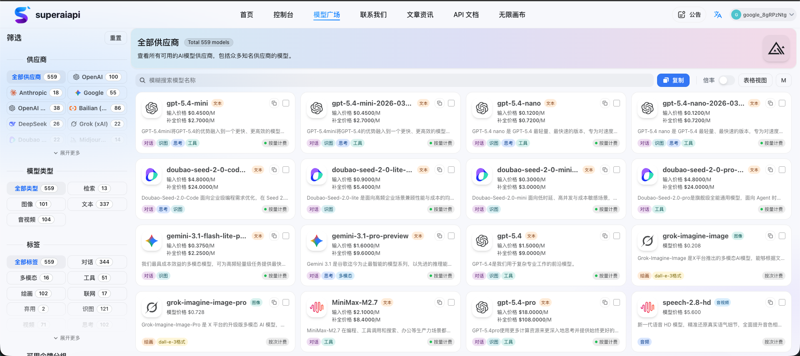

### 第三步：看价格和分组

点击模型卡片后，右侧会显示价格和支持的分组。尽量优先选择倍率小于 `1` 的分组，这样整体成本更低。

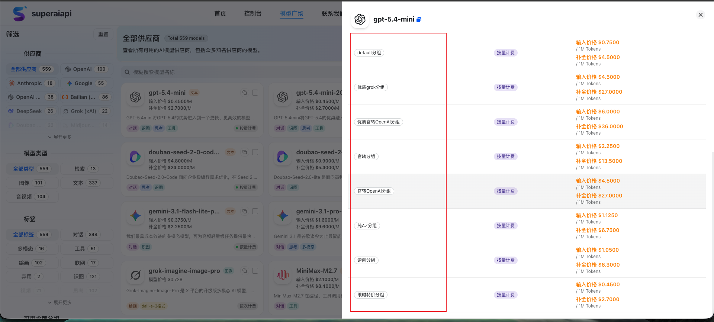

有些模型的输入输出成本甚至可以做到接近官方价格的十分之一。

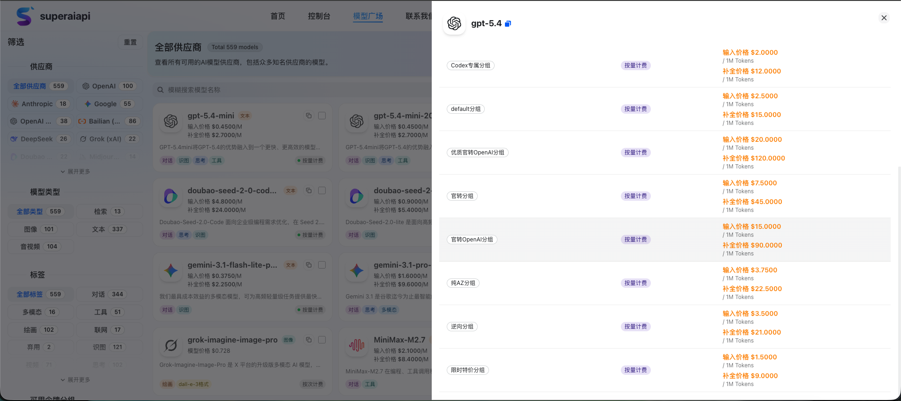

### 第四步：创建 API 令牌

点击右上角用户名，进入 `API 令牌` 页面，然后创建新的令牌。

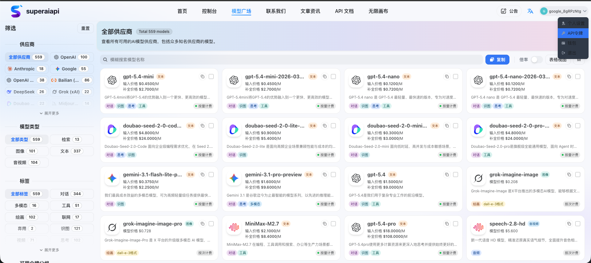

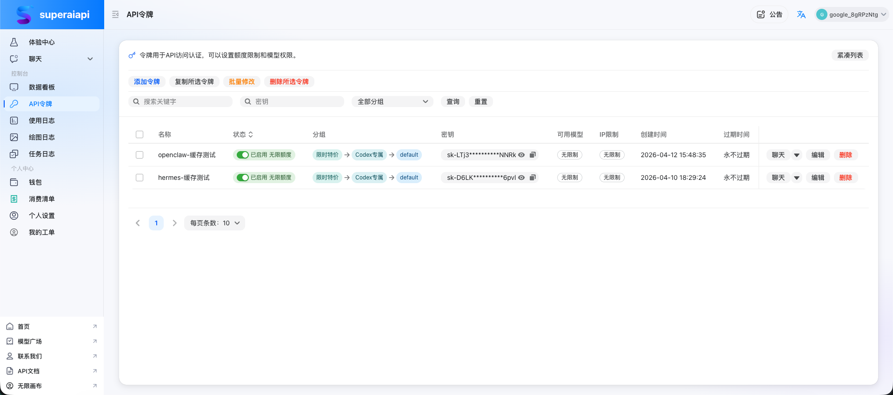

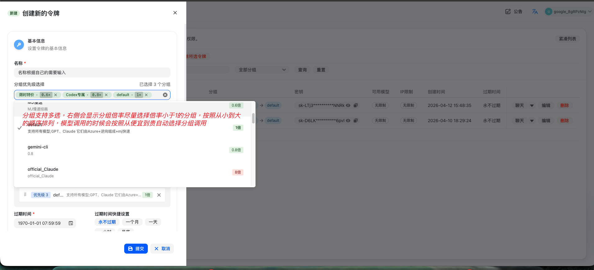

### 第五步：拿到 base_url 和 API key

令牌创建成功后，把平台提供的 `base_url` 和 `api_key` 保存下来，后面可以直接填进 Codex 或者配置脚本中。这里的 `base_url` 可以填写为：`https://superaiapi.com/v1`。

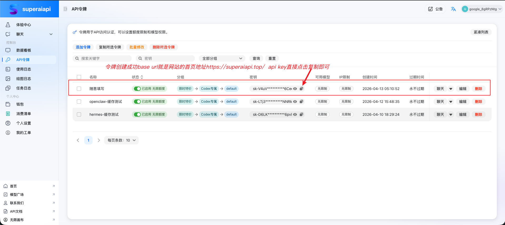

## 最短使用说明

先确认电脑系统和架构，然后进入对应目录。

Windows：

```powershell
.\install-codex-windows-x64.cmd
.\run-codex-setup.cmd
codex
```

macOS Apple Silicon：

```bash
bash ./install-codex-macos-arm64.sh
bash ./setup-codex-macos.sh
codex
```

macOS Intel：

```bash
bash ./install-codex-macos-x64.sh
bash ./setup-codex-macos.sh
codex
```
